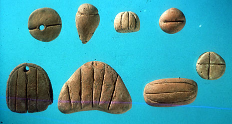
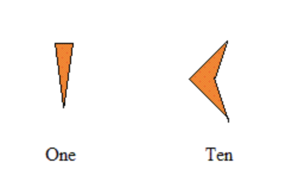
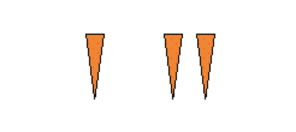
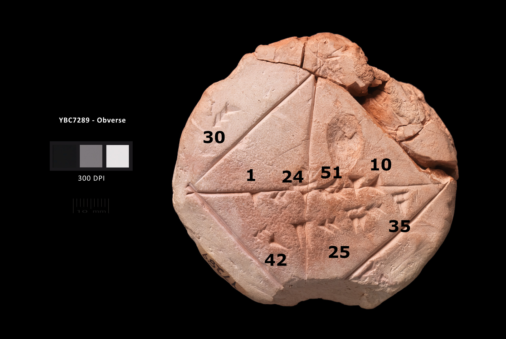
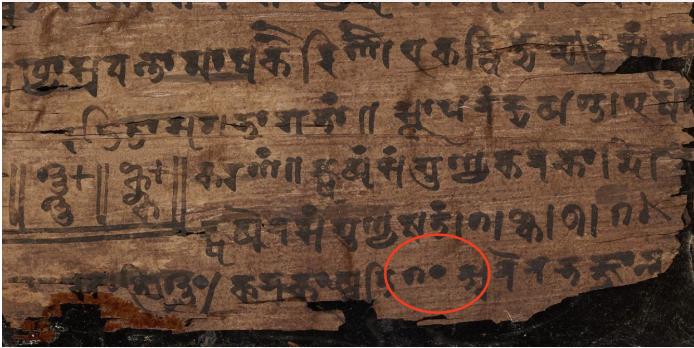
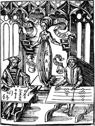
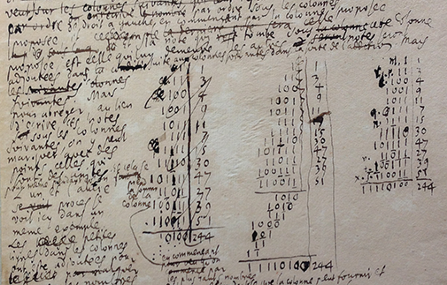
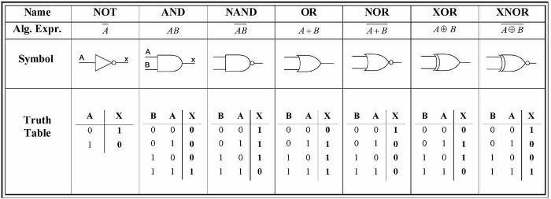

#  CSCI 1103 Computer Science 1 Honors

## Fall 2020

Robert Muller - Boston College

---

## Lecture Notes

## Week 7: Symbols, Numeral Systems & Digital Representations

**Topics:**

1. Symbols & Numeral Systems
2. Digital Representations

---

## 1. Symbols & Numeral Systems

Crows can count to 5, give or take, and rats can count up to about 7, so the studies say. My two Labrador Retrievers seem to be able to count no higher than 3. There's some evidence of a common hard-wired [number sense](http://cognitionandculture.net/wp-content/uploads/the-number-sense-how-the-mind-creates-mathematics.pdf) in higher organisms using the *one, two, many* system. Of course, no other organism can match the human ability to reason quantitatively. There is evidence that pre-agrarian hunter/gatherers were recording tallies with notches on bones more than 70 thousand years ago. There is some speculation that this counting was related to the lunar cycle for either family planning or to predict ocean tides.

Our need to reason about numbers didn't really kick-in until the development of agriculture in the Neolithic Era between 7 and 10 thousand years ago. With the discovery of wheat, settlements grew in what is now Eastern Turkey, Syria and Iraq; trade followed. How many bushels of wheat did I harvest? How many paces must I walk to reach the edge of my field? I had 10 goats and I've traded for 6 more, how many do I have? 

Early settlement dwellers developed a sophisticated systems of  [stone tokens](https://sites.utexas.edu/dsb/tokens/tokens/) for keeping track of quantities of various types and for recording exchanges of things of value.



The word *calculate* is derived from the Greek word *khálix* or *pebble*. 

Over the centuries, the system of counting tokens gave way to a more manageable system using specific shapes i.e., *symbols*, impressed into a clay surface with a reed stylus. Of course this was a precursor to [cuneiform writing](https://en.wikipedia.org/wiki/Cuneiform), and eventually to our modern numeral system. By around 2000 BCE, the Sumerians used the following symbols to denote quantities ranging from 1 to 59:


This is a [sexagesimal](https://en.wikipedia.org/wiki/Sexagesimal) or base 60 system. A few properties worth noting:

1. The 59 digit symbols are made with just two different reed tips:

   

   Digits for 1 through 9 are stacks of ones; ten is a wedge. The digit "system" is decimal. Digits for numbers between 11 and 59 have two positions -- with no space in between them! -- so the digit for 24 is a tightly packed pair of wedges adjacent to a pile of four ones.

2. It's thought that the Sumerians used base 60 because 60 has a lot of, i.e., 12, integer factors. For example, the 60-minute hour can be broken down into two 30s, three 20s, four 15s, five 12s, six 10s, twelve 5s, etc.

3. The system is base 60 but there are only 59 digits! The missing digit is [zero](https://www.nationalgeographic.com/news/2017/09/origin-zero-bakhshali-manuscript-video-spd/), it will take many centuries to sort that out.

4. For numbers larger than 59, a *sequence* of digit symbols is employed, adjacent to one another but with a space between. For example, 62 is represented as

   

   where the one symbol on the left denotes 60 (i.e., $1\times 60^1$). This embodies the main idea of modern positional numeral systems: use *sequences of digit symbols* with each digit symbol being interpreted relative to its *position* in the sequence. The right-most symbol represents 1s (i.e., $60^0$s), the next digit symbol represents 60s (i.e., $60^1$s), and so forth.

   Now you might ask, if they didn't have a digit for zero, how did they denote 60? Good question! Well we aren't the first people to deal with bugs.

Notwithstanding the missing digit, the Sumerian/Babylonian positional numeral system was fantastically successful and the Babylonians developed a highly-advanced system of mathematics. One hint of the power of the system can be found in an inscription on a small piece of clay, [YBC 7289](https://en.wikipedia.org/wiki/YBC_7289), which is thought to be from circa 1800 BCE. It was found in the early 20th century near Basra, Iraq. It is currently in the Yale Babylonian Collection.



The inscription shows that the Babylonians knew the Pythagorean Theorem (~1300 years before the birth of Pythagorus) and that they had recursive algorithms for computing numerical approximations. The number inscribed on this small piece of clay approximates the irrational number $\sqrt{2}$ accurate to 6 decimal places. (!)   

#### TODO: 

1. **explain the numeric value here**;

2. **explain the idea of an empty place-holder.**

### East and West

The ideas developed in the fertile crescent paralleled systems developed in Asia and India. Over the centuries, there was a great deal of cross-fertilization of ideas traveling east and west with traders along the Silk Road. 


Of course there were many fundamental developments in China, Greece, Egypt, Central America and other regions. But the development of *algebra* required a more robust, complete and systematic numeral system. This would first arise in greater India, present day Pakistan.

### Zero

Indian scientific culture and mathematics were quite advanced in the early centuries of the first millennium. The first known or commonly accepted occurrence of the digit zero appears on a piece of Birch bark that was unearthed in 1881 in a field outside of Peshawar, Pakistan. The collection of 80 delicate bark fragments, called the [Bakshali manuscript](https://en.wikipedia.org/wiki/Bakhshali_manuscript), records a set of mathematical writings dated to the 2nd or 3rd century CE. The first zero appears in the bottom row as a dot.



The Hindu (Gwalior) numeral system was a positional decimal system with the full set of *ten* digit symbols and as such was a great leap forward over the existing nine-digit Brahmi system.


The Gwalior system was foundational in the writings of [Brahmagupta](https://en.wikipedia.org/wiki/Brahmagupta), a 7th century Indian astronomer and mathematician. Sometime around 628 CE, Brahmagupta published the famous *Brāhmasphuṭasiddhānta* (*The Correctly Established Doctrine of Brahma*), which was putatively on the subject of astronomy but its long-lasting contribution was to lay out some of the basic laws of what we now know as algebra. For example, Brahmagupta's laws state that 

+ the sum or difference of any number and zero is that number;
+ the product of any number and zero is zero;
+ the quotient of any number and zero is undefined.

> We've written these laws out in plain English rather than modern symbolic mathematical notation to emphasize the fact that the *variable* (not to mention the equal sign) wouldn't be introduced for still another 1000 years. The variable was more or less invented by the French cryptographer [François Viète]([https://en.wikipedia.org/wiki/Fran%C3%A7ois_Vi%C3%A8te](https://en.wikipedia.org/wiki/François_Viète)) in 1595. The idea and notation was further refined by Descartes and Leibniz, who is credited with coining the term "variable". The full working definition of the modern idea of a variable would have to wait until very recently, 1879, when the German logician [Gottlob Frege](https://en.wikipedia.org/wiki/Gottlob_Frege) published [Begriffsschrift](https://en.wikipedia.org/wiki/Begriffsschrift) (*Concept Notation -- A Formula Language, Modeled on that of Arithmetic, of Pure Thought*).
>
> The equal sign = was invented in 1557 by [Robert Recorde](https://en.wikipedia.org/wiki/Robert_Recorde). It proved to be a great way to save on expensive ink and paper, it abbreviated the six letter and eleven-stroke word "Equals" with only two horizontal strokes of the letter "E".

### The Man from Khwarazm

Around 150 years later, circa 780 CE, Muhammad ibn Musa was born in [Khwarazm](https://en.wikipedia.org/wiki/Khwarazm), an oasis just south of the (former) Aral Sea in part of the expansive Persian Empire. Today we know the city as Khiva, Uzbekistan. Sometime around 820 CE, Muhammad ibn Musa relocated with his intellectual gifts west along the Silk Road to the [House of Wisdom](https://en.wikipedia.org/wiki/House_of_Wisdom) in present-day Baghdad, Iraq. There he was known as Muhammad ibn Musa *Al-Khwarizmi* – “the man from Khwarazm”.

*Al-Khwarizmi* was a prodigious scholar with a special interest in the Indian scientific texts that arrived in Baghdad over the Silk Road. He was most interested in Brahmagupta's writings on astronomy and mathematics. Among other things, al-Khwarizmi published, in Arabic:

+ *kitāb al-ḥisāb al-hindī* (*Book on computation with Indian numerals*);
+ *kitab* *al-jam'* *wa'l-tafriq* *al-ḥisāb al-hindi*  (*Addition and subtraction in Indian arithmetic*) and most important:
+ *al-Kitāb* *al-mukhtaṣar* *fī* *ḥisāb* **al-jabr** *wal-muqābala* (*The Compendious Book on Calculation by Completion and Balancing)*.

Thereby introducing and extending the powerful Hindu system of mathematics in the expanding Arab world.

### Algebra and Algorithm

The Arabic *al* translates as the English definite article *the*. The Arabic word *jabr* means *reunion of broken parts*. After many years and translation through Latin, we know *the reunion of broken parts* (al-jabr) as *algebra*. 

> Though in medieval Spain, the word *algebra* was interpreted somewhat more literally, it referred to the surgical treatment of bone fractures.

The English word *algorithm* is derived from *algorismus*, the Latin translation of *al-Khwarizmi* (i.e., the man from Khwarazm). 

We know algebra as a set of rules governing computation with numbers and, importantly, with unknowns (what we now call variables).

> al-Khwarizmi: When I consider what people generally want in calculating, I've found that it is always a number.

Before laying out any more of the story of computation, it's worth taking a minute to reflect. In this course, we've taken an algebraic approach to computation. In particular 

+ We've viewed *computation* as the systematic simplification of symbolic algebraic expressions (enriched with various types and forms: functions, tuples, records, variants, etc). 
+ We've been interested in the *cost* of a computational process, which is naturally quantified by the number of simplification steps required to get from a reducible expression to its irreducible form (i.e., value). 
+ We've viewed *coding* as a natural "operational" extension of algebra. We've written code in OCaml to implement various algorithms, i.e., repetitive processes for solving problems.

As we go forward, we're going to see how to realize computation on a modern digital computer. This will offer up a different, machine-centric view of computation. Both views are useful.

##TODO: Clean all of this stuff up.

### Positional Numeral Systems

As we have seen, a positional numeral system is a symbolic system for representing numbers with sequences of digit symbols. For example, the decimal numeral 2026 is a sequence of 4 digits drawn from the familiar set of ten Hindu digits 0, 1, 2, 3, 4, 5, 6, 7, 8 and 9.



The Arabic/Hindu numeral systems would not be introduced to the west until the 13th century. 

~1170 CE: Leonardo Bonacci di Pisa; 

•learns Arabic mathematics/Hindu numeral system while living in Algeria with his father;

•1202: publishes *Liber Abaci* (*Book* *of Calculation*), introducing *modus* *Indorum* in Europe.

This was done in a book *Liber Abaci* (The Book of Calculation) by the Italian mathematician, [Leonardo Bonacci](https://en.wikipedia.org/wiki/Fibonacci) aka Fibonacci, who's principal contribution to mathematics was to recognize the power of the system then used in the Arab world.

#### Interpreting Positional Numerals

In this section we'll illustrate several concepts by working with numerals represented in OCaml as lists of digits. First  we'll define two helper functions that will be used throughout the remainder section.

```ocaml
(* intPower : int -> int -> int
*)
let intPower m n = (int_of_float ((float m) ** (float n)))

(* div : int -> int -> int * int
*)
let div m n = (m / n, m mod n)
```

The meaning of each occurrence of a digit in a numeral is determined by its position relative to the right end of the numeral, hence the *positional*. In 2026, the leftmost occurrence of the digit 2, denotes the number 2000 or $2\times 10^3$. The occurrence of the digit 2 adjacent to the digit 6 denotes the number 20 or $2\times 10^1$ and the digit 6 denotes the number 6 or $6\times 10^0$. The number denoted by the complete numeral is the sum of the values of each of the digits.

$$2026 = 2 \times 10^3 + 0 \times 10^2 + 2 \times 10^1 + 6 \times 10 ^0 = 2000 + 0 + 20 + 6$$

Each digit is the co-efficient of the base raised to the power of the position relative to the right edge of the sequence. The meaning of the numeral is the sum of these products.

One way to understand this system is by implementing it in OCaml using lists of digits to represent a sequence of digits as in `[2; 0; 2; 6]`. For numerals represented as lists of digits, we can compute the numbers represented by the numerals as follows.

```ocaml
(* meaning : digit list -> int

  The call (meaning digits) returns the number represented by the sequence
  of decimal digits.
*)
let meaning digits =
  let repeat digits position sum =
    match digits with
    | [] -> sum
    | digit :: digits ->
      let n = digit * (intPower 10 position)
      in
      repeat digits (position + 1) (n + sum)
  in
  repeat (List.rev digits) 0 0
```

The basic positional numeral system described above accounts only for the *natural numbers* — the non-negative integers. To account for negative integers or real numbers requires additional work, we'll touch on it below.

#### The Algorithm for Positional Addition of Decimal Numerals

Positional numerals are especially attractive because they're easy to work with. That is to say, there are simple methods — algorithms — that we can use to add, subtract, multiply and divide them. For most of us,  the addition algorithm was the first "official" algorithm that we learned. It's simple enough that it can be taught to children of age 6 or so. It's worth noting that in 13th century Europe, the simple algorithm for positional addition was actually called *algorism* after what was learned from Fibonacci's Liber Abaci.

Consider two decimal numerals represented as lists of digits `[mk; …; m0]` and `[nk; …; n0]`. The method by which we can produce the sum of these involves performing digit-wise addition from right to left, carrying over higher powers of 10 as we go.

```ocaml
(* addDecimal : int list -> int list -> int list

   The call (addDecimal ms ns) where ms and ns are equal-length lists of single
   digit integers representing decimal numerals, returns the list of digits
   representing their sum. NB: we assume ms and ns are of the same length.
*)
let addDecimal ms ns =
  let rec repeat ms ns carryIn answer =
    match (ms, ns) with
    | ([], []) -> answer
    | (m :: ms, n :: ns) ->
      let (carryOut, sumDigit) = div (m + n + carryIn) 10
      in
      repeat ms ns carryOut (sumDigit :: answer)
    | _ -> failwith "addDecimal: this cannot happen."
  in
  repeat (List.rev ms) (List.rev ns) 0 []
```

> The word "algorithm" is generally understood as referring to a set of instructions for solving a problem. But most interesting algorithms are *repetitive*.

#### Alternative Bases

In positional systems, numerals are sequences of digits drawn from a fixed set of digit symbols that are determined by the numeral's *base*. The flexibility of the system with respect to bases seems to have been first noted by  [Gottfried Leibniz](https://en.wikipedia.org/wiki/Gottfried_Wilhelm_Leibniz) who introduced the modern binary numeral system in 1679. We'll explore the binary system in the next section.

As we noted above, for base 10 or *decimal* numerals, we use the familiar set of ten Hindu digits: 0, 1, 2, 3, 4, 5, 6, 7, 8 and 9. The fact that the sequence of digits 2026 is a base 10 numeral is implicit. The base can be signaled explicitly by annotating the digit sequence with the base as a subscript as in $2026_{10}$. For base 5, say, we use the five digits 0, 1, 2, 3 and 4. For base 2 or *binary* we use only two digits 0 and 1 and for base 16 — *hexadecimal* — we use the standard ten decimal digits together with the first six letters of the alphabet A, B, C, D, E and F.

### Sibling Bases that are Powers of 2 — Binary and Hexadecimal

We've seen how to use strings of bits to represent alphabetic symbols and non-negative integers. It turns out that we can use bits to represent pretty much anything that we'd like to represent in a computer: documents, songs, pictures, videos, you name it.  But understanding strings of bits quickly gets out of hand, there are just too many of them!

We can abbreviate strings of bits using base 16 or **hexadecimal** or just **hex** notation.  Base 10 numerals are strings of digits drawn from the familiar set of 10 decimal digits (i.e., {0, 1, ..., 9}) and base 2 numerals are drawn from the set of 2 binary digits {0, 1}. Base 16 numerals are strings of 16 hexadecimal digits. What are they? Well it seems reasonable to use the decimal digits 0 through 9 for the first 10 hex digits, then we'll use the first 6 letters of the alphabet A, B, C, D, E and F. In particular, A denotes 10, B denotes 11 etc.

Lets look at the 16 numbers 0 through 15 in decimal, binary and hex.

| decimal | binary | hex  |      | decimal | binary | hex  |
| :-----: | :----: | :--: | ---- | :-----: | :----: | :--: |
|    0    |  0000  |  0   |      |    8    |  1000  |  8   |
|    1    |  0001  |  1   |      |    9    |  1001  |  9   |
|    2    |  0010  |  2   |      |   10    |  1010  |  A   |
|    3    |  0011  |  3   |      |   11    |  1011  |  B   |
|    4    |  0100  |  4   |      |   12    |  1100  |  C   |
|    5    |  0101  |  5   |      |   13    |  1101  |  D   |
|    6    |  0110  |  6   |      |   14    |  1110  |  E   |
|    7    |  0111  |  7   |      |   15    |  1111  |  F   |

Considering the binary for $14_{10}$ we see:

```
1110_2 = (1 x 2^3) + (1 x 2^2) + (1 x 2^1) + (0 x 2^0)
       = (1 x 8) + (1 x 4) + (1 x 2) + (0 x 1)
       = 8 + 4 + 2 + 0
       = 14_10
       = E_16
```

Of course we can interpret hexadecimal numerals in decimal in the usual way. E.g.:

```
1AB_16 = (1 x 16^2) + (A x 16^1) + (B x 16^0)
       = (1 x 256) + (A x 16) + (B x 1)
       = 256 + 160 + 11
       = 427_10
```

Going the other way:

```
digits(427, 16) = (26, 11)
digits(26,  16) = (1,  10)
digits(1,   16) = (0,  1)
```

 So reading our hex digits from bottom-to-top our hex numeral is $1AB_{16}$.

Note that you can type binary numerals in OCaml by prefixing `0b` to the left and you can type hexadecimal numerals into OCaml by prefixing `0x` to the left. Thus:

```ocaml
# 0b1010;;
- : int = 10
```

If our positional numeral system is all it's cracked up to be the following should be fine:

```ocaml
  01        11          carry to the left as usual
  1AB_16 =  427_10
+ 04C_16 =   76_10
------------------
  1F7_16 =  503_10
```

 You can readily confirm this by typing `0x1AB + 0x4C` into an OCaml REPL.

As we said above, we can use bits to represent pretty much anything that we're interested in, numbers, spreadsheets, songs, pictures, videos, you name it. Since $2^4 = 16$, we can use one hexadecimal digit as an abbreviation or shorthand for a string of 4 bits. Since this is half of a byte, it's often called a *nibble*. Then it's clear that we can use a pair of hexadecimal digits to represent a byte.

For example, $\mathtt{3B_{16}}$, can be seen as an abbreviation for $\mathtt{0011 1011_2}$. This explains the 4-bit grouping of bits.

#### Conversion Between Bases

We sometimes need to convert numerals between one base and another. To develop our understanding, we'll implement the process in OCaml using lists of digits as shown above.  It will turn out to be convenient to use base 10 as an intermediary.

```ocaml
(* convert : int list -> int -> int -> int list

   The call (convert digits fromBase toBase) converts the numeral represented
   by digits from base fromBase to base toBase.
*)
let convert digits fromBase toBase =
  let decimal = toDecimal digits fromBase
  in
  decimalTo decimal toBase
```

Converting from an arbitrary base to decimal is easy, we just need to compute the sum described above. This is exactly the `meaning` function from above except that we've replaced the fixed base `10` with a variable.

```ocaml
(* toDecimal : int list -> int -> int

  The call (toDecimal digits base) returns the decimal numeral represented
  by the sequence of digits in the given base.
*)
let toDecimal digits base =
  let repeat digits position sum =
    match digits with
    | [] -> sum
    | digit :: digits ->
      let n = digit * (intPower base position)
      in
      repeat digits (position + 1) (n + sum)
  in
  repeat (List.rev digits) 0 0
```

There are a number of different ways to covert from decimal to some other base. One efficient way to accomplish this is to build the numeral digit-by-digit using modular arithmetic. Let

Lets say we have a decimal numeral M and we'd like to find it's equivalent in base N. The we can apply the `div` function (defined above) repetitively as follows. For M = 20 and N = 2:

```
div 20 2 = (10, 0)
div 10 2 = (5,  0)
div  5 2 = (2,  1)
div  2 2 = (1,  0)
div  1 2 = (0,  1)
```

And the bits in the binary numeral representing 20 can be read from least significant to most significant from top to bottom: 10100. So one easy way to convert from decimal to an arbitrary base is simply to orchestrate the calls to `div` collecting the remainders as we go.

```ocaml
(* decimalTo : int -> int -> int list

   The call (decimalTo n base) returns a list of digits [d; ..; d] which represents
   the decimal numeral n in the provided base.
*)
let decimalTo n base =
  let rec repeat n answer =
    match n = 0 with
    | true  -> answer
    | false ->
      let (quotient, remainder) = div n base
      in
      repeat quotient (remainder :: answer)
  in
  repeat n []
```

It's natural to expect that `toDecimal` and `decimalTo` are inverses. I.e., that for any `base` and any decimal numeral `n` that:

```ocaml
n = toDecimal (decimalTo n base) base
```


---

## 2. Digital Representations

Your friend Martha isn't actually in your contacts list, she actually lives in the physical world, she's merely *represented* in your list by a symbolic proxy, hopefully a unique symbolic proxy, otherwise you might confuse her with your friend Mei. A touchstone of digital computers is their use of *sequences* *of symbols* as a universal proxy or representation language.

Let's say we have a set $A$ with $k$ unique symbols $A = \{a_1, …, a_k\}$ and let's consider sequences of symbols drawn from $A$. How many $A$-sequences are there of length $n$? There are $k^n$ such sequences. For example, consider $k=3$ with $A = \{ a, b, c \}$. There are $3^1 = 3$ $A$-sequences of length $n =1$: $a$, $b$ and $c$ and there are $3^2 = 9$ $A$-sequences of length $n = 2$: $aa$, $ab$, $ac$, $ba$, $bb$, $bc$, $ca$, $cb$ and $cc$. If we had 6 contacts, sequences of length $n = 2$ would suffice because we'd have a unique pattern to represent each contact with 3 left over. 

Electronic digital computers use a fixed number of discrete electronic voltages to represent the unique symbols in $A$. In theory one could choose any number of such voltages, e.g., $k = 3$ — we might call this a *ternary* *digital* *computer*. But it turns out to be best to choose $k = 2$ or *binary* because, as far as the engineering goes, it's easier and more cost-effective to distinguish only between a high voltage and a low voltage, than it is to distinguish between say 3 voltage levels. 

The two basic voltage states in a binary digital computer can be characterized in many ways: *on* or *off*, *up* or *down*, *true* or *false*, *yin* or *yang*, *black* or *white* but most commonly — because of our natural interest in numbers — they are thought of as *binary* *digits*, or *bits*: 1 or 0. Hence the phrase: *digital* computer. From here on, we'll use the standard terminology using both "digital computer" or just "computer" to refer to a binary digital computer.

We'll often be working with sequences of bits. How long are the bit sequences? Well, it depends on what sort of thing we need to represent. For example, if we're interested in representing the four nucleotides *adenine*, *cytosine*, *guanine* and *thymine*, we could choose $n = 2$ because $2^2 = 4$ and we'd have exactly one 2-bit pattern for each nucleotide. We might choose, say

| adenine | cytosine | guanine | thymine |
| :-----: | :------: | :-----: | :-----: |
|   00    |    01    |   10    |   11    |

If we wanted to represent the 26 uppercase letters in the Roman alphabet, **A** through **Z**, we'd need bit sequences of length $n = 5$ because $2^5 = 32$. This enables us to choose a unique sequence for each letter (with 6 left over). Choosing $n = 4$ wouldn't do because $2^4 = 16$ — too few patterns to have unique representations. As far as the particular choices go, it might be natural to choose

> It's worth noting here that for the purposes of representing the items in question, nucleotides or letters, we're viewing the bit sequences here simply as unique *patterns* — in particular, we're not interpreting the sequences as numerals.

**Protocols**

These are both reasonable representation systems because they provide unique patterns to the items being represented. However, any representation system is useless if it isn't recognized and adopted by all parties working with the represented items. If one computer is running a bioinformatics application and sharing data with applications on another computer, a *protocol* or *convention* must be established between the two applications that ensures that the 2-bit pattern 10 means guanine and not adenine.

#### Bytes — ASCII and the Representation of Alphabetic Symbols

A quick glance at your computer's keyboard will show something like 5 or 6 rows of keys, each with something like 13 or 14 keys across. Some are labeled with letters, some with digits, some with punctuation symbols, some are control keys. A back of the envelop calculation gives  and the various control keys such as shift, we wind up having somewhere north of 130 different characters that we might type on a standard Roman alphabet keyboard. What length bit string would be needed to provide a unique representation for each key? We choose bit sequences of length  because  provides enough unique patterns.

A US and Latin-alphabet based protocol for character codes (the [American Standard Code for Information Interchange](https://en.wikipedia.org/wiki/ASCII), aka ASCII) was established a long time ago -- in the early 1960s. 

The ASCII standard code assigns the 8-bit sequence 01000001 as the representation of the letter **A**, it assigns the 8-bit sequence 01000010 for **B** and so forth. The ASCII code assigns the 8-bit sequence 00110000 as the representation of the digit **0**. The ASCII table is shown below in the section on Numeral Systems.

##### Example: The Text of the Gettysburg Address

Any file with the `.txt` extension is interpreted as ASCII text. Here's part of the file `gettysburg.txt`.

```
Four score and seven years ago our fathers brought forth on this
continent a new nation, conceived in liberty, and dedicated to the
proposition that all men are created equal.

Now we are engaged in a great civil war, testing whether that nation,
or any nation, so conceived and so dedicated, can long endure. We are
met on a great battle-field of that war. We have come to dedicate a
portion of that field, as a final resting place for those who here
gave their lives that that nation might live. It is altogether fitting
and proper that we should do this.
...
```

The discussion above explains why the bit and the byte are the basic units of storage on digital computers. But most computations are concerned with numbers of various kinds: natural numbers, integers or real numbers. How are they represented? And how are we to represent more numbers that the very limited  patterns available in a byte?

ASCII has been superseded with a newer international code called [Unicode](http://www.unicode.org/). Unicode establishes a 16-bit code which has enough bit patterns () to account for all of the non-Roman alphabets throughout the world.

> It's worth noting that if we changed the file extension to something else, say `.xlsx`, then Microsoft Excel would attempt to interpret these same bits as a spreadsheet file. Of course it would fail because the bits aren't laid out in the manner required for an Excel spreadsheet.

The file byte addresses run from left to right across the top from byte 00 to byte 15 (0xff). We see that the byte at position 00, `0x46`, is the representation of the letter `F` and so forth.


If we examine the underlying representation of these letters we would see.

## 3. Towards a Binary Digital Computer

As we mentioned in the previous meeting notes, the flexibility of the positional numeral system with respect to bases seems to have been first noted by Leibniz in the late 17th century. 



Leibniz showed that the basic arithmetic algorithms used for decimal numerals also work when the constant base 10 has been replaced by another base.

```ocaml
(* div : int -> int -> int * int

   The call (div m n) returns the quotient and remainder.
*)
let div m n = (m / n, m mod n)

(* addDigits : int -> int -> int -> int * int

   This is a helper function for the add function.
   The call (addDigits m n carryIn) returns the sum
   digit and the carry digit of a one-digit slice of
   positional addition.
*)
let addDigits m n carryIn base = div (m + n + carryIn) base

(* add : int list -> int list -> int -> int list

The call (add ms ns base) where ms and ns are equal-length lists of single digit integers representing numerals in base, returns the list of digits representing their sum.
*)
let add ms ns base =
  let rec repeat ms ns carryIn answer =
    match (ms, ns) with
    | ([], []) -> answer
    | (m :: ms, n :: ns) ->
      let (carryOut, sumDigit) = addDigits m n carryIn base
      in
      repeat ms ns carryOut (sumDigit :: answer)
  in
  repeat (List.rev ms) (List.rev ns) 0 []
```

Leibniz was particularly interested in the binary numeral system which he introduced in a publication in 1679. His notebooks contain many examples of binary computations.

> Leibniz was also interested in automating computation and designed a machine, the [Stepped Reckoner](), which could perform addition, subtraction, multiplication and division of decimal numerals. In addition to his many other skills, Leibniz was an enthusiastic marketer of his computer:
>
> “It is unworthy of excellent men to lose hours like slaves in the labour of calculation which could safely be relegated to anyone else if machines were used."
>
> — Leibniz in 1685, describing the value to astronomers of the hand-cranked calculating machine he had invented in 1673.
>
> Leibniz' design for the Stepped Reckoner used an intricate system of rotating gears, but the technical requirements were hard to meet in the technology of the day so the stepped-reckoner wasn't functional until centuries later.

### 1. Revisiting the Addition Algorithm for Binary

Both the `addDecimal` and its more general `add` function above use a helper function `div` for handling the addition of a single position in a numeral. The `div` helper function returns both the carry digit and the sum digit.

```ocaml
(* div : int -> int -> int * int
*)
let div m n = (m / n, m mod n)
```

This is a little unsatisfactory in some ways since one wouldn't expect to need operations as complicated as division and remainder to be required as subtasks of something as simple as single-digit addition. If we restrict our attention to binary numerals, this position-addition subtask can be implemented by logical operations that can easily be rendered in physical hardware.

#### Single Digit Addition — A Full Adder

The task of adding bits `a` and `b` together with a possible carry-in `Cin` and producing a `sum` and a possible carry-out `Cout` is called a [full adder](https://en.wikipedia.org/wiki/Adder_(electronics)#Full_adder). We can see what is required by looking at a [truth table](). The 3 columns on the left are the inputs while the two columns on the right are the outputs. There are $2^3= 8$ permutations of 3 binary inputs:

|  a   |  b   | Cin  | sum  | Cout |
| :--: | :--: | :--: | :--: | :--: |
|  0   |  0   |  0   |  0   |  0   |
|  0   |  0   |  1   |  1   |  0   |
|  0   |  1   |  0   |  1   |  0   |
|  0   |  1   |  1   |  0   |  1   |
|  1   |  0   |  0   |  1   |  0   |
|  1   |  0   |  1   |  0   |  1   |
|  1   |  1   |  0   |  0   |  1   |
|  1   |  1   |  1   |  1   |  1   |

Looking down the output column labeled **sum**, we see that there are 1s in 4 different rows. From top to bottom, lets call them **A**, **B**, **C** and **D**. So we might say that **sum** is 1 when **A** *or* **B** *or* **C** *or* **D** is 1. Looking at the row for **A**, the second row, we see that **A** is 1 when **a = 0** *and* **b = 0** *and* **c = 1**. So we can write the **sum** result out logically as

```
sum = (a = 0 and b = 0 and c = 1) or (a = 0 and b = 1 and c = 0) or ...
```

Of course we can also specify the **Cout** column similarly:

```
Cout = E or F or G or H where E = ...
```

The rule for **sum** can be simplified somewhat if we express 0 and 1 logically, replacing 0, say, with **false** and 1 with **true**:

```
sum = ((not a) and (not b) and c) or ((not a) and b and (not c)) or ...
```

#### Truth Tables and Logic Gates

The rule above for **sum** will correctly compute when a 1 is to be written below the line during addition of bits. But it's a fairly complicated (i.e., large) rule. It turns out that there is a smaller rule:

```
sum = (a xor b) xor c
```

where `xor` means "exclusive or". Similarly, the **Cout** result can be computed efficiently as:

```
Cout = ((a xor b) and Cin) or (a and b)
```

It's time to get down to brass tacks about the basic logical operators. For the purpose of the present discussion we need only three two-input logical operators: **and**, **or** and **xor**. The way they work can be spelled out in a truth table. The two columns labeled **a** and **b** are inputs, the others are outputs.

|   a   |   b   | a **and** b | a **or** b | a **xor** b |
| :---: | :---: | :---------: | :--------: | :---------: |
| false | false |    false    |   false    |    false    |
| false | true  |    false    |    true    |    true     |
| true  | false |    false    |    true    |    true     |
| true  | true  |    true     |    true    |    false    |

These very simple functions are often drawn out visually as [circuit diagrams](https://en.wikipedia.org/wiki/Circuit_diagram). In the following, we're only using three of the diagrams.



Using these building blocks, a circuit implementing single-bit addition with a possible carry-in, a [full-adder](https://en.wikipedia.org/wiki/Adder_(electronics)#Full_adder), is:


> Try it out by assuming a few binary inputs for A, B and Cin to confirm that you get the right outputs for S and Cout. It works!

Once we have a one-bit full-adder, we can add multi-bit numerals simply by wiring the full-adders together. For example, for 2-bit numerals we can implement

```
c1 c0 = a1 a0 + b1 b0
```

as a [ripple-carry adder](https://en.wikipedia.org/wiki/Adder_(electronics)#Ripple-carry_adder). Here we show a simple 2-bit ripple-carry adder:

```
             a1                    a0                    b1             b0
              |                     |                     |              |
              |   +-----------------+---------------------+              |
              |   |                 |                                    |
              |   |                 |   +--------------------------------+
              v   v                 v   v
            +-------+             +-------+
   +--Cout--+       |<-Cin--Cout--+       |<----Cin----- 0
   |        +---+---+             +---+---+
   |            |                     |
   v            v                     v
overflow       c1                     c0
```

Full-adders can be wired together for longer bit sequences, notably, 32-bits and 64-bits.

It turns out that we can effectively develop similar circuit-diagrams for subtraction, multiplication, division, etc. leading to a large circuit known as an [arithmetic and logic unit](https://en.wikipedia.org/wiki/Arithmetic_logic_unit) which contains circuits for all of these operations plus a few more.
